# Natural/Adabas to Java Spring Boot Migration Plan

## Table of Contents

1. [Executive Summary](#1-executive-summary)
2. [Current System Analysis](#2-current-system-analysis)
3. [User Requirements Specification (URS)](#3-user-requirements-specification-urs)
4. [Test Specifications](#4-test-specifications)
5. [Target Architecture](#5-target-architecture)
6. [Database Schema Design](#6-database-schema-design)
7. [Java Project Structure](#7-java-project-structure)
8. [Validation Strategy](#8-validation-strategy)
9. [Scaling Strategy](#9-scaling-strategy)
10. [Phased Migration Timeline](#10-phased-migration-timeline)
11. [Risk Register](#11-risk-register)

---

## 1. Executive Summary

### Current State
- **Language:** Natural 4GL (Software AG)
- **Database:** Adabas on z/OS mainframe
- **Programs:** Two core batch programs — Premium Rate Update (Structured Mode) and Accounts Reporting (Reporting Mode)
- **Environment:** IBM z/OS mainframe with proprietary runtime

### Target State
- **Language:** Java 21
- **Framework:** Spring Boot 3.x with Spring Batch
- **Database:** PostgreSQL (replacing Adabas)
- **Caching:** Redis
- **Messaging:** Apache Kafka
- **Deployment:** Kubernetes (containerized microservices)
- **Infrastructure:** Docker Compose for local development

### Migration Approach
**Strangler Fig Pattern** — parallel run with progressive cutover:
1. Deploy Java services alongside the existing Natural/Adabas system
2. Run both systems in parallel with output comparison
3. Gradually route traffic to the new system
4. Decommission the legacy system after validation

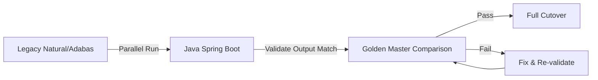

---

## 2. Current System Analysis

### Program 1: Premium Rate Update (Structured Mode)

**Purpose:** Batch update of insurance premium rates for MO POLS (Base Premium) in the CENT-CODES-FILE2 Adabas file.

**Program Flow — R1 through R4 Pipeline:**

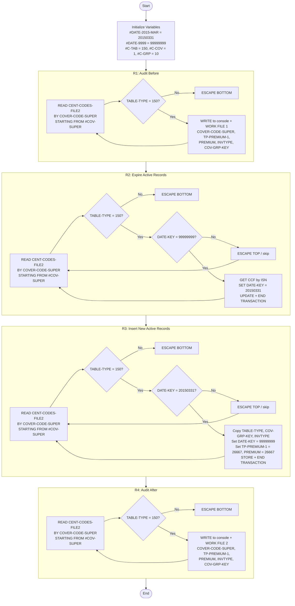

**Key Data Structures:**
- `#COV-SUPER (A16)` — Composite superdescriptor: `#C-TAB(N3) + #C-COVG(N3)[=#C-COV(N1)+#C-GRP(N2)] + #C-AREA(A2) + #C-DATE(N8)`
- `CENT-CODES-FILE2` VIEW — TABLE-TYPE, DATE-KEY, TP-PREMIUM(1:10), COVER-CODE-SUPER, PREMIUM, COV-GRP-KEY, INVTYPE

### Program 2: Accounts Reporting (Reporting Mode)

**Purpose:** Generate tilde-delimited financial report of accounts with agent commission processing, including validation, filtering, and amount formatting.

**Program Flow:**

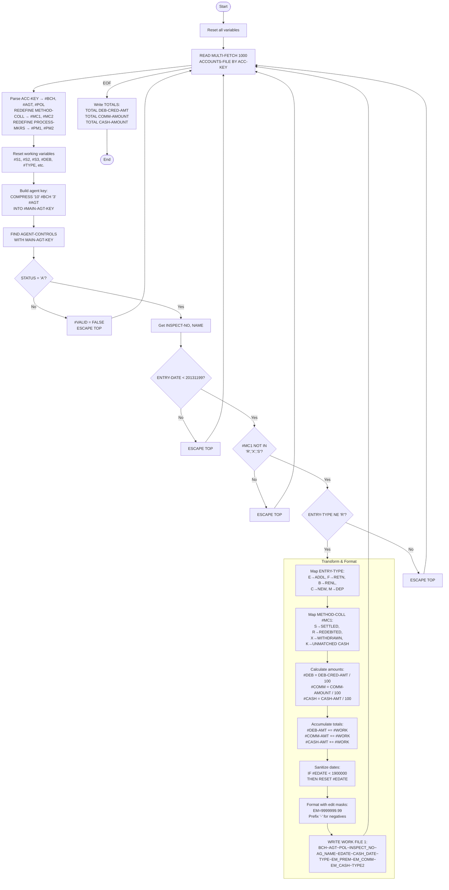

**Key Data Structures:**
- `#ACC-KEY (A18)` — REDEFINE: `#BCH(A3) + #AGT(A6) + #POL(A9)`
- `METHOD-COLL` — REDEFINE: `#MC1(A1) + #MC2(A1)`
- Amount fields: `#DEB(N7.2)`, `#COMM(N7.2)`, `#CASH(N7.2)` with edit mask `EM=9999999.99`

---

## 3. User Requirements Specification (URS)

### Premium Rate Update Requirements

| Req ID   | Business Rule | Source Lines | Natural Code Reference |
|----------|--------------|-------------|----------------------|
| PRM-001  | Read all CENT-CODES-FILE2 records by COVER-CODE-SUPER starting from constructed key (TABLE-TYPE=150, COV=1, GRP=10) | 0490-0560 | `R1. READ CENT-CODES-FILE2 BY COVER-CODE-SUPER STARTING FROM #COV-SUPER` |
| PRM-002  | Export current state of all matching records to Work File 1 (audit-before) | 0540-0550 | `WRITE WORK FILE 1 COVER-CODE-SUPER TP-PREMIUM(1) PREMIUM INVTYPE COV-GRP-KEY` |
| PRM-003  | For records with DATE-KEY=99999999, update DATE-KEY to 20150331 (expire active records) | 0600-0720 | `CCF.DATE-KEY := #DATE-2015-MAR` followed by `UPDATE(G1.)` |
| PRM-004  | Commit each update individually (per-record transaction) | 0700 | `END TRANSACTION` |
| PRM-005  | For records with DATE-KEY=20150331 (just expired), create new record with DATE-KEY=99999999 and premium=26667 | 0760-0930 | `CCF.TP-PREMIUM(1) := 26667` ... `STORE CCF` |
| PRM-006  | New records must copy TABLE-TYPE, COV-GRP-KEY, and INVTYPE from the expired record | 0820-0850 | `CCF.TABLE-TYPE := CENT-CODES-FILE2.TABLE-TYPE` etc. |
| PRM-007  | Commit each insert individually (per-record transaction) | 0910 | `END TRANSACTION` |
| PRM-008  | Export final state of all matching records to Work File 2 (audit-after) | 0970-1040 | `WRITE WORK FILE 2 COVER-CODE-SUPER TP-PREMIUM(1) PREMIUM INVTYPE COV-GRP-KEY` |

### Accounts Reporting Requirements

| Req ID   | Business Rule | Source Lines | Natural Code Reference |
|----------|--------------|-------------|----------------------|
| RPT-001  | Read all accounts using multi-fetch of 1000 records, ordered by ACC-KEY | 23 | `READ MULTI-FETCH 1000 ACCOUNTS-FILE BY ACC-KEY` |
| RPT-002  | Decompose ACC-KEY into branch (A3), agent (A6), policy (A9) | 16 | `REDEFINE #ACC-KEY(#BCH(A3) #AGT(A6) #POL(A9))` |
| RPT-003  | Build agent lookup key: '10' + branch + '3' + agent | 34 | `COMPRESS '10' #BCH '3' #AGT INTO #MAIN-AGT-KEY LEAVING NO SPACE` |
| RPT-004  | Look up agent in AGENT-CONTROLS by MAIN-AGT-KEY | 35 | `FIND AGENT-CONTROLS WITH MAIN-AGT-KEY = #MAIN-AGT-KEY` |
| RPT-005  | Skip record if agent status is not 'A' (Active) | 37-44 | `IF STATUS(AG.) NE 'A' DO #VALID = FALSE DOEND` |
| RPT-006  | Skip record if ENTRY-DATE >= 20131199 | 47 | `IF (#EDATE < 20131199)` |
| RPT-007  | Skip record if METHOD-COLL first character is 'R', 'X', or 'S' | 48-49 | `AND (#MC1 NE 'R' AND #MC1 NE 'X' AND #MC1 NE 'S')` |
| RPT-008  | Skip record if ENTRY-TYPE = 'R' (accrued commission) | 50 | `AND (ENTRY-TYPE(AC.) NE 'R')` |
| RPT-009  | Map ENTRY-TYPE: E→ADDL, F→RETN, B→RENL, C→NEW, M→DEP | 56-69 | `DECIDE ON FIRST VALUES ENTRY-TYPE` |
| RPT-010  | Map METHOD-COLL first char: S→SETTLED, R→REDEBITED, X→WITHDRAWN, K→UNMATCHED CASH | 70-81 | `DECIDE ON FIRST VALUES #MC1` |
| RPT-011  | Convert amounts by integer division by 100 with truncation | 83-97 | `#DEB = DEB-CRED-AMT(AC.) / 100` |
| RPT-012  | Accumulate running totals for DEB-CRED-AMT, COMM-AMOUNT, CASH-AMT | 98-106 | `#DEB-AMT = #DEB-AMT + #WORK` |
| RPT-013  | Reset dates less than 1900000 to zero | 108-111 | `IF #EDATE < 1900000 THEN DO RESET #EDATE DOEND` |
| RPT-014  | Format amounts with edit mask EM=9999999.99, prefix '-' for negatives | 113-128 | `MOVE EDITED #DEB(EM=9999999.99) TO #EM-PREM` |
| RPT-015  | Output tilde-delimited report: BCH~AGT~POL~INSPECT_NO~AG_NAME~EDATE~CASH_DATE~TYPE~EM_PREM~EM_COMM~EM_CASH~TYPE2 | 138-140 | `WRITE WORK 1 VARIABLE #BCH '~' #AGT '~' ...` |

---

## 4. Test Specifications

### Premium Rate Update Tests

| Test ID    | Test Case | Requirements Covered | Expected Outcome |
|-----------|-----------|---------------------|-----------------|
| T-PRM-001 | Read and export records with TABLE-TYPE=150 to audit file | PRM-001, PRM-002 | Work File 1 contains all matching records with correct fields |
| T-PRM-002 | Skip records where TABLE-TYPE != 150 | PRM-001 | Non-150 records excluded from processing |
| T-PRM-003 | Expire records: update DATE-KEY from 99999999 to 20150331 | PRM-003, PRM-004 | Records with DATE-KEY=99999999 now have DATE-KEY=20150331 |
| T-PRM-004 | Create new active records from expired ones | PRM-005, PRM-006, PRM-007 | New records exist with DATE-KEY=99999999, premium=26667, copied metadata |
| T-PRM-005 | End-to-end batch: R1→R4 pipeline produces correct audit files | PRM-001 through PRM-008 | audit-before and audit-after files match expected content |
| T-PRM-006 | Per-record transactions: each update/insert committed individually | PRM-004, PRM-007 | Transaction count matches record count |
| T-PRM-007 | Golden master: batch output matches known-good legacy output | All PRM | Line-by-line match of audit files against golden master |

### Accounts Reporting Tests

| Test ID    | Test Case | Requirements Covered | Expected Outcome |
|-----------|-----------|---------------------|-----------------|
| T-RPT-001 | Parse ACC-KEY into branch, agent, policy | RPT-002 | 18-char key correctly split: 3+6+9 |
| T-RPT-002 | Build agent lookup key correctly | RPT-003 | "10" + branch + "3" + agent produces correct composite key |
| T-RPT-003 | Filter: inactive agent (status != 'A') | RPT-005 | Record skipped, not in output |
| T-RPT-004 | Filter: entry date >= 20131199 | RPT-006 | Record skipped |
| T-RPT-005 | Filter: METHOD-COLL first char is R, X, or S | RPT-007 | Record skipped |
| T-RPT-006 | Filter: ENTRY-TYPE = 'R' | RPT-008 | Record skipped |
| T-RPT-007 | Map ENTRY-TYPE codes correctly | RPT-009 | E→ADDL, F→RETN, B→RENL, C→NEW, M→DEP |
| T-RPT-008 | Full filter chain: valid record passes all filters | RPT-005-008 | Record appears in output with correct transformations |
| T-RPT-009 | Output format: tilde-delimited with correct field order | RPT-015 | BCH~AGT~POL~INSPECT_NO~AG_NAME~EDATE~CASH_DATE~TYPE~EM_PREM~EM_COMM~EM_CASH~TYPE2 |
| T-RPT-010 | Amount conversion: integer division with truncation | RPT-011, RPT-014 | 123456 → 1234.56, negative amounts prefixed with '-' |
| T-RPT-011 | Totals accumulation matches sum of individual records | RPT-012 | TOTAL DEB-CRED-AMT, TOTAL COMM-AMOUNT, TOTAL CASH-AMOUNT |

### Non-Functional Tests

| Test ID   | Test Case | Expected Outcome |
|----------|-----------|-----------------|
| T-NF-001 | Batch processing with 100k+ records | Completes within SLA, no OOM errors |
| T-NF-002 | Database connection pool under load | Pool handles concurrent batch steps |
| T-NF-003 | Redis cache hit rate for agent lookups | >90% cache hit rate after warm-up |
| T-NF-004 | Kubernetes HPA scales agent-service under load | Scales from 2 to 10 replicas based on CPU |

### Golden Master Testing

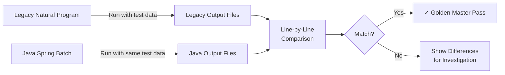

### Parallel Run Validation

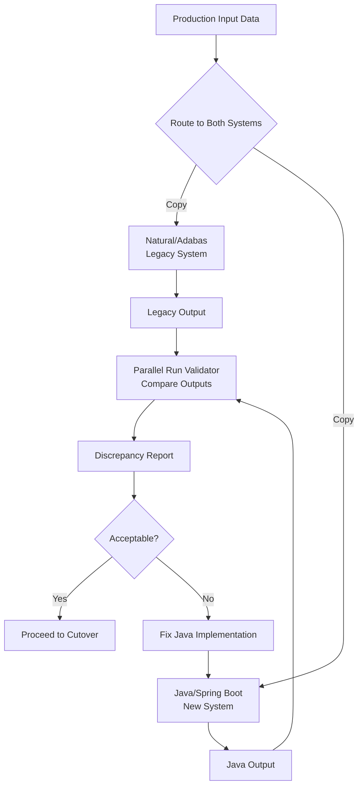

---

## 5. Target Architecture

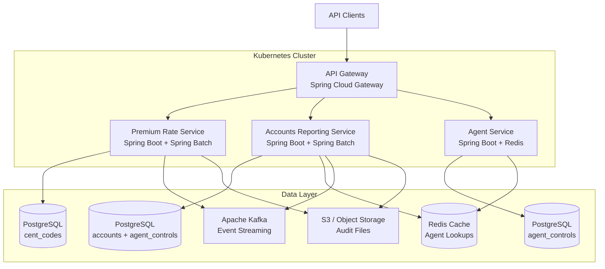

### Natural-to-Java Construct Mapping

| Natural Construct | Java Equivalent | Notes |
|-------------------|----------------|-------|
| `DEFINE DATA LOCAL` | Java class fields / records | Local variable block → class-scoped fields |
| `VIEW OF` | `@Entity` JPA mapping | Database view → JPA entity with `@Table` |
| `REDEFINE` | Java `record` with `fromComposite()` / `toComposite()` | Overlay → parsing/formatting methods |
| `READ ... BY` | `JpaPagingItemReader` with `ORDER BY` | Sequential read → Spring Batch reader |
| `FIND ... WITH` | `findBy...()` Spring Data query | Keyed search → repository method |
| `GET *ISN` | `findById()` | ISN fetch → primary key lookup |
| `UPDATE` | `save()` / `JpaItemWriter` | Record update → JPA persist |
| `STORE` | `save()` / `JpaItemWriter` | Record insert → JPA persist |
| `END TRANSACTION` | `chunk(1)` in Spring Batch | Per-record commit → chunk size 1 |
| `ESCAPE TOP` | `return null` in `ItemProcessor` | Skip iteration → filter by returning null |
| `ESCAPE BOTTOM` | Breaking condition in reader query | Exit loop → query boundary condition |
| `MOVE EDITED ... TO` | `BigDecimal` formatting + `DecimalFormat` | Edit mask → Java number formatting |
| `COMPRESS ... INTO ... LEAVING NO` | `String.concat()` / `+` operator | Concatenation → string building |
| `RESET` | Assign default values | Clear → reinitialize |
| `WRITE WORK FILE` | `FlatFileItemWriter` | Work file → file writer |
| `MULTI-FETCH 1000` | `pageSize(1000)` on `JpaPagingItemReader` | Batch fetch → pagination |

---

## 6. Database Schema Design

### PostgreSQL Tables Replacing Adabas Files

#### cent_codes (replaces CENT-CODES-FILE2)

```sql
CREATE TABLE cent_codes (
    id              BIGSERIAL PRIMARY KEY,
    table_type      SMALLINT NOT NULL,
    date_key        INTEGER NOT NULL,
    tp_premium_1    INTEGER,
    tp_premium_2    INTEGER,
    tp_premium_3    INTEGER,
    tp_premium_4    INTEGER,
    tp_premium_5    INTEGER,
    tp_premium_6    INTEGER,
    tp_premium_7    INTEGER,
    tp_premium_8    INTEGER,
    tp_premium_9    INTEGER,
    tp_premium_10   INTEGER,
    cover_code_super VARCHAR(16) NOT NULL,
    premium         INTEGER NOT NULL,
    cov_grp_key     VARCHAR(16),
    inv_type        VARCHAR(8),
    created_at      TIMESTAMP DEFAULT NOW(),
    updated_at      TIMESTAMP DEFAULT NOW()
);
```

#### accounts (replaces ACCOUNTS-FILE)

```sql
CREATE TABLE accounts (
    id              BIGSERIAL PRIMARY KEY,
    acc_key         VARCHAR(18) NOT NULL,
    branch          VARCHAR(3) NOT NULL,
    agent           VARCHAR(6) NOT NULL,
    policy          VARCHAR(9) NOT NULL,
    entry_type      CHAR(1),
    entry_date      INTEGER,
    deb_cred_amt    BIGINT,
    comm_amount     BIGINT,
    cash_amt        BIGINT,
    cash_date       INTEGER,
    method_coll     VARCHAR(2),
    process_mkrs    VARCHAR(2)
);
```

#### agent_controls (replaces AGENT-CONTROLS)

```sql
CREATE TABLE agent_controls (
    id              BIGSERIAL PRIMARY KEY,
    main_agt_key    VARCHAR(12) NOT NULL,
    status          CHAR(1) NOT NULL,
    inspect_no      SMALLINT,
    name            VARCHAR(25)
);
```

### Index Strategy (Replacing Adabas Superdescriptors)

| Adabas Superdescriptor | PostgreSQL Index | Purpose |
|----------------------|-----------------|---------|
| COVER-CODE-SUPER | `CREATE INDEX idx_cent_codes_cover_super ON cent_codes (cover_code_super)` | Sequential read by composite key |
| TABLE-TYPE + DATE-KEY | `CREATE INDEX idx_cent_codes_table_type_date ON cent_codes (table_type, date_key)` | Filter by type and date |
| ACC-KEY | `CREATE INDEX idx_accounts_acc_key ON accounts (acc_key)` | Sequential read by account key |
| MAIN-AGT-KEY | `CREATE INDEX idx_agent_controls_key ON agent_controls (main_agt_key)` | Agent lookup by composite key |

---

## 7. Java Project Structure

```
insurance-modernization/
├── pom.xml                          (parent POM — Java 21, Spring Boot 3.2.x)
├── common/
│   ├── pom.xml
│   └── src/
│       ├── main/java/com/insurance/common/
│       │   ├── domain/
│       │   │   ├── CoverCodeSuper.java          (REDEFINE of #COV-SUPER)
│       │   │   └── AccountKey.java              (REDEFINE of #ACC-KEY)
│       │   ├── mapper/
│       │   │   ├── EntryTypeMapper.java          (ENTRY-TYPE → text mapping)
│       │   │   └── MethodCollMapper.java         (METHOD-COLL → text mapping)
│       │   └── util/
│       │       ├── AmountConverter.java          (amount / 100 with truncation)
│       │       ├── DateSanitizer.java            (date < 1900000 → 0)
│       │       └── AgentKeyBuilder.java          (COMPRESS '10' #BCH '3' #AGT)
│       └── test/java/com/insurance/common/
│           ├── domain/
│           │   ├── CoverCodeSuperTest.java
│           │   └── AccountKeyTest.java
│           ├── mapper/
│           │   ├── EntryTypeMapperTest.java
│           │   └── MethodCollMapperTest.java
│           └── util/
│               ├── AmountConverterTest.java
│               ├── DateSanitizerTest.java
│               └── AgentKeyBuilderTest.java
├── premium-rate-service/
│   ├── pom.xml
│   └── src/
│       ├── main/
│       │   ├── java/com/insurance/premium/
│       │   │   ├── PremiumRateApplication.java
│       │   │   ├── domain/
│       │   │   │   └── CentCodesRecord.java      (JPA entity)
│       │   │   ├── repository/
│       │   │   │   └── CentCodesRepository.java
│       │   │   ├── service/
│       │   │   │   └── PremiumRateService.java
│       │   │   ├── batch/
│       │   │   │   └── PremiumRateBatchConfig.java (R1→R4 Spring Batch)
│       │   │   └── controller/
│       │   │       └── PremiumRateController.java
│       │   └── resources/
│       │       ├── application.yml
│       │       └── db/migration/
│       │           └── V1__create_cent_codes.sql
│       └── test/java/com/insurance/premium/
│           ├── service/
│           │   └── PremiumRateServiceTest.java
│           ├── batch/
│           │   ├── PremiumRateBatchIT.java
│           │   └── PremiumRateGoldenMasterIT.java
│           └── repository/
│               └── CentCodesRepositoryTest.java
├── accounts-reporting-service/
│   ├── pom.xml
│   └── src/
│       ├── main/
│       │   ├── java/com/insurance/reporting/
│       │   │   ├── AccountsReportingApplication.java
│       │   │   ├── domain/
│       │   │   │   ├── AccountRecord.java
│       │   │   │   └── AgentControl.java
│       │   │   ├── repository/
│       │   │   │   ├── AccountRepository.java
│       │   │   │   └── AgentControlRepository.java
│       │   │   ├── service/
│       │   │   │   └── AgentLookupService.java
│       │   │   ├── batch/
│       │   │   │   ├── AccountsReportBatchConfig.java
│       │   │   │   ├── AccountItemReader.java
│       │   │   │   ├── AccountFilterProcessor.java
│       │   │   │   ├── AccountTransformProcessor.java
│       │   │   │   ├── TildeDelimitedWriter.java
│       │   │   │   └── ReportTotalsListener.java
│       │   │   ├── dto/
│       │   │   │   └── ReportLine.java
│       │   │   └── controller/
│       │   │       └── ReportController.java
│       │   └── resources/
│       │       ├── application.yml
│       │       └── db/migration/
│       │           ├── V1__create_accounts.sql
│       │           └── V2__create_agent_controls.sql
│       └── test/java/com/insurance/reporting/
│           ├── batch/
│           │   ├── AccountFilterProcessorTest.java
│           │   ├── AccountTransformProcessorTest.java
│           │   ├── TildeDelimitedWriterTest.java
│           │   └── AccountsReportBatchIT.java
│           └── service/
│               └── AgentLookupServiceTest.java
├── agent-service/
│   ├── pom.xml
│   └── src/
│       ├── main/
│       │   ├── java/com/insurance/agent/
│       │   │   ├── AgentServiceApplication.java
│       │   │   ├── domain/
│       │   │   │   └── AgentControl.java
│       │   │   ├── repository/
│       │   │   │   └── AgentControlRepository.java
│       │   │   ├── service/
│       │   │   │   └── AgentService.java
│       │   │   └── controller/
│       │   │       └── AgentController.java
│       │   └── resources/
│       │       ├── application.yml
│       │       └── db/migration/
│       │           └── V1__create_agent_controls.sql
│       └── test/java/com/insurance/agent/
│           ├── service/
│           │   └── AgentServiceTest.java
│           └── controller/
│               └── AgentControllerIT.java
└── infrastructure/
    ├── docker-compose.yml
    └── k8s/
        ├── premium-rate-deployment.yml
        ├── accounts-reporting-deployment.yml
        └── agent-service-deployment.yml
```

### Spring Batch Job Mapping (R1→R4 as Separate Steps)

| Natural Label | Spring Batch Step | Reader | Processor | Writer |
|--------------|-------------------|--------|-----------|--------|
| R1 | Step 1: auditBefore | JpaPagingItemReader (table_type=150) | — | FlatFileItemWriter (audit-before.csv) |
| R2 | Step 2: expireActive | JpaPagingItemReader (table_type=150, date_key=99999999) | ExpireProcessor (date→20150331) | JpaItemWriter (UPDATE) |
| R3 | Step 3: insertNewActive | JpaPagingItemReader (table_type=150, date_key=20150331) | NewRecordProcessor (date→99999999, premium→26667) | JpaItemWriter (INSERT) |
| R4 | Step 4: auditAfter | JpaPagingItemReader (table_type=150) | — | FlatFileItemWriter (audit-after.csv) |

---

## 8. Validation Strategy

### 3-Level Validation

#### Level 1: Unit Tests

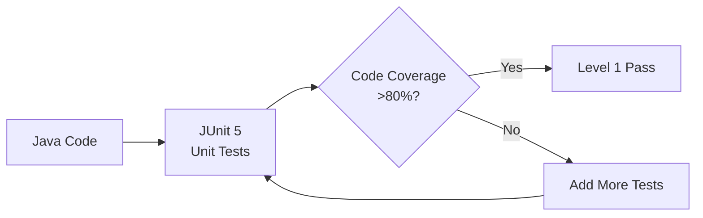

- Test each mapper, converter, and domain object in isolation
- Verify edge cases: zero values, negative amounts, max-length strings
- Mock database interactions for service-layer tests

#### Level 2: Golden Master Tests

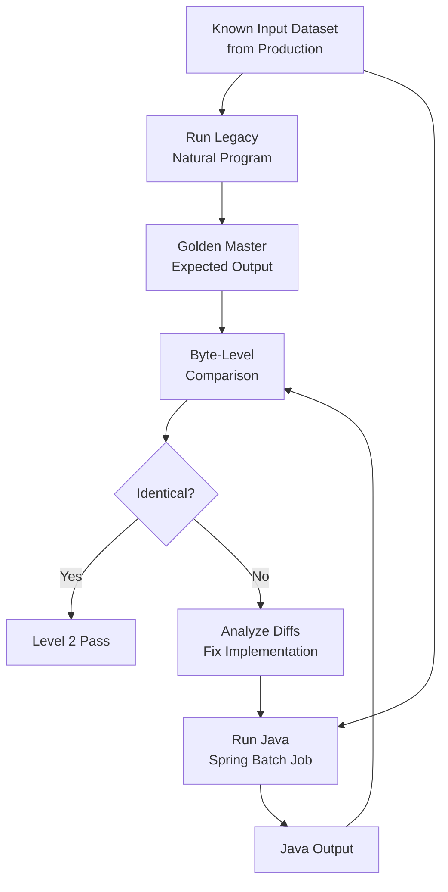

- Use production-representative datasets captured from the legacy system
- Compare output files byte-by-byte
- Any difference triggers investigation before proceeding

#### Level 3: Parallel Run

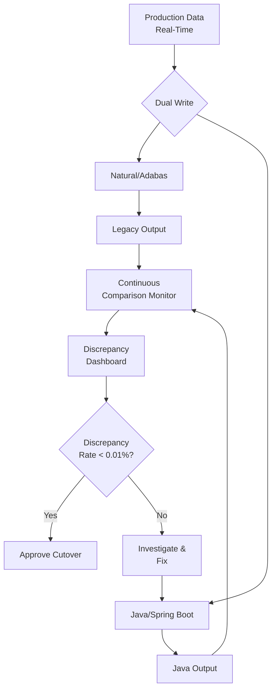

- Run both systems against production data simultaneously
- Compare outputs in real-time
- Only proceed to cutover when discrepancy rate is below threshold

---

## 9. Scaling Strategy

| Concern | Solution | Details |
|---------|----------|---------|
| Agent lookup latency | Redis caching | `@Cacheable("agents")` on AgentService — cache agent records with TTL. Expected >90% cache hit rate. |
| Large batch processing | Spring Batch partitioning | Partition by COVER-CODE-SUPER prefix or ACC-KEY range. Each partition runs as a separate thread. |
| Database read load | PostgreSQL read replicas | Route batch reads to replicas, writes to primary. Use `@Transactional(readOnly=true)` for read operations. |
| Service availability | Kubernetes HPA | Horizontal Pod Autoscaler on agent-service: min 2, max 10 replicas. Scale on CPU (70%) or custom metrics. |
| Batch throughput | Chunk sizing optimization | Start with chunk(100) for audit steps, chunk(1) for transactional steps. Tune based on profiling. |
| Memory pressure | JpaPagingItemReader | Page-based reading prevents loading entire dataset into memory. Page size 1000 matches Natural MULTI-FETCH. |
| Audit file storage | S3/Object Storage | Write audit files to S3 instead of local disk. Enables distributed access and retention policies. |
| Event-driven processing | Apache Kafka | Publish batch completion events. Other services can react to rate updates or report generation. |

---

## 10. Phased Migration Timeline

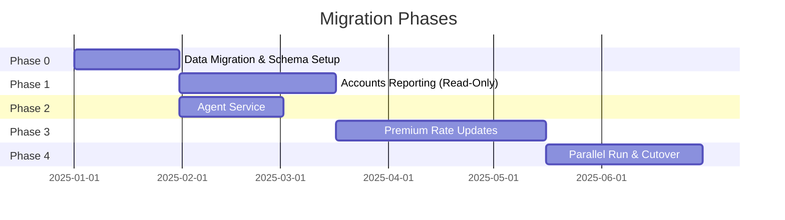

### Phase 0: Data Migration (4 weeks)
- Set up PostgreSQL schemas and indexes
- ETL pipeline: Adabas → PostgreSQL using Apache NiFi or custom extractors
- Validate row counts and data integrity
- Establish bi-directional sync for parallel run period

### Phase 1: Accounts Reporting — Read-Only (6 weeks)
- Deploy accounts-reporting-service
- Run golden master tests against production data extracts
- Begin parallel run: generate reports from both systems
- Compare output files daily
- **Low risk** — read-only operation, no data modification

### Phase 2: Agent Service (4 weeks)
- Deploy agent-service with Redis caching
- Integrate with accounts-reporting-service
- Load test agent lookup endpoint
- Validate cache behavior and TTL settings

### Phase 3: Premium Rate Updates (8 weeks)
- Deploy premium-rate-service
- Run golden master tests for R1→R4 pipeline
- Parallel run with shadow writes (Java writes to separate schema)
- Validate transaction semantics match Natural's per-record commits
- **Highest risk** — write operations require careful validation

### Phase 4: Cutover (6 weeks)
- Final parallel run with production data
- Stakeholder sign-off on validation reports
- DNS/routing switch to Java services
- Monitor for 2 weeks post-cutover
- Decommission Natural/Adabas programs

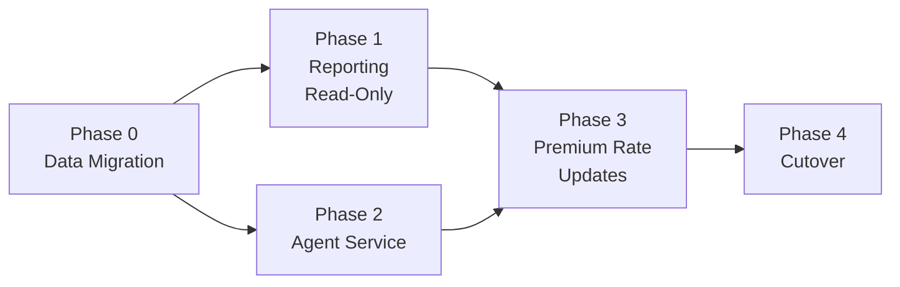

---

## 11. Risk Register

| Risk ID | Risk | Impact | Likelihood | Mitigation |
|---------|------|--------|-----------|-----------|
| RISK-001 | **Superdescriptor ordering mismatch** — PostgreSQL index sort order differs from Adabas COVER-CODE-SUPER ordering | High | Medium | Create integration tests that verify sort order matches. Use `COLLATE "C"` for byte-level ordering. Compare first 1000 records from both systems. |
| RISK-002 | **Numeric truncation differences** — Natural integer division truncates differently than Java for negative numbers | High | High | Use `RoundingMode.DOWN` (truncate toward zero) in `BigDecimal.divide()`. Test with negative amounts extensively. Add golden master tests for edge cases. |
| RISK-003 | **REDEFINE overlay misalignment** — Composite key parsing produces different values than Natural's REDEFINE | High | Medium | Create exhaustive unit tests for `CoverCodeSuper.fromComposite()` and `AccountKey.fromComposite()`. Test with production key samples. |
| RISK-004 | **Transaction semantics difference** — Spring Batch chunk processing doesn't match Natural's per-record `END TRANSACTION` | High | Low | Use `chunk(1)` for R2 and R3 steps. Verify with intentional failures mid-batch that only processed records are committed. |
| RISK-005 | **MULTI-FETCH timing differences** — Pagination with `JpaPagingItemReader` may produce different results if data changes during read | Medium | Low | Use `READ COMMITTED` isolation level. For golden master tests, use static datasets. For production, accept that reporting is eventually consistent. |
| RISK-006 | **Edit mask formatting differences** — Java `DecimalFormat` produces different output than Natural's `EM=9999999.99` | Medium | Medium | Create comprehensive formatting tests. Compare Natural output with Java output for 100+ representative values. Handle leading zeros and sign placement. |
| RISK-007 | **Date sentinel handling** — Legacy system uses various sentinel values (99999999, 0, dates < 1900000) | Medium | Low | Document all sentinel values. Implement `DateSanitizer` with full coverage. Test boundary values (1899999, 1900000, 1900001). |
| RISK-008 | **Agent cache staleness** — Redis cache may serve stale agent status after updates | Low | Medium | Set appropriate TTL (5 minutes). Implement cache invalidation on agent updates via Kafka events. Monitor cache hit/miss rates. |
| RISK-009 | **Data migration completeness** — Adabas records may have undocumented field values or formats | High | Medium | Run data profiling on all Adabas fields before migration. Document all distinct values. Create validation queries post-migration. |
| RISK-010 | **Concurrent batch execution** — Multiple batch job instances could corrupt data | High | Low | Use Spring Batch's built-in job instance tracking. Configure `spring.batch.job.enabled=false` to prevent auto-start. Use database-level advisory locks. |
